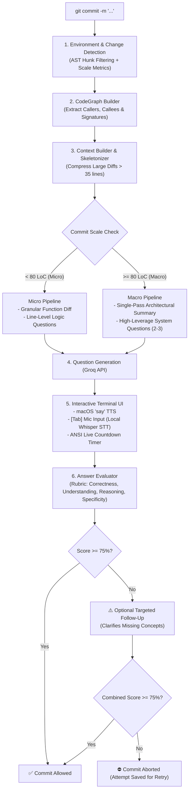

# 🧠 Understanding Agent: AI-Powered Code Understanding Pre-Commit Hook

> An intelligent, voice-interactive Git pre-commit hook that verifies developers actually understand the code they are committing — now **multi-language**, **security-aware**, and **domain-aware**.

**Supported stacks**: Python (incl. ML/data-science), JavaScript/TypeScript (React, Next, Vue, Angular, Node, Express, NestJS), C#/.NET (ASP.NET Core, EF Core), Go, Rust, Java, Kotlin, Ruby, PHP, Swift, C/C++, SQL. Frameworks and domains are detected from your manifests (package.json, pyproject/requirements, *.csproj, go.mod, Cargo.toml, ...) and questions adapt accordingly.

---

## 📌 Table of Contents

- [The Problem: Why This Exists](#-the-problem-why-this-exists)
- [How It Works: Core Architecture](#-how-it-works-core-architecture)
- [Dual-Mode Engine: Micro vs. Macro Changes](#-dual-mode-engine-micro-vs-macro-changes)
- [Key Features](#-key-features)
- [Project Structure & Components](#-project-structure--components)
- [Tech Stack & Dependencies](#-tech-stack--dependencies)
- [Installation & Setup](#-installation--setup)
- [Integration with Any Git Repository](#-integration-with-any-git-repository)
- [Audio & Voice Agent Guide](#-audio--voice-agent-guide)
- [Design Decisions & Trade-Offs](#-design-decisions--trade-offs)

---

## 🎯 The Problem: Why This Exists

With the rise of AI coding assistants (GitHub Copilot, Cursor, ChatGPT, Gemini, Claude), developers can generate hundreds of lines of code in seconds. While productivity increases, it introduces critical organizational risks:

1. **Vibe Coding & Blind Commits**: Developers commit complex logic, regexes, or async workflows without understanding edge cases or side effects.
2. **Hidden Invariants & Logic Bombs**: Automated code often works on the happy path but fails silently during failure states, concurrency spikes, or boundary conditions.
3. **Rubber-Stamp Code Reviews**: Reviewers assume the author understands the code, leading to unvetted changes entering `main`.

### The Solution: The "Oral Defense" Git Hook
`understanding-agent` acts as an automated, interactive **oral defense** at commit time. Whenever a developer runs `git commit`, the hook:
1. Analyzes the staged diff and cross-file dependencies.
2. Formulates 2–3 targeted questions testing **logic, data flow, invariants, and edge cases**.
3. Speaks the questions aloud and accepts answers either by **typing** or by **voice** via your microphone (transcribed using local OpenAI Whisper).
4. Evaluates the answers using an LLM evaluator against the actual AST changes.
5. **Allows the commit** if average understanding score is **> 75%**, or **aborts the commit** if understanding is missing.

---

## 🏗️ How It Works: Core Architecture



---

## ⚡ Dual-Mode Engine: Micro vs. Macro Changes

The hook automatically adapts its evaluation strategy based on the size and complexity of the commit:

| Feature | Micro Mode (`< 80 LoC`) | Macro Mode (`≥ 80 LoC` or multi-file) |
|---|---|---|
| **Primary Focus** | Line-by-line logic, return values, local loops | System architecture, component coordination, data contracts |
| **Diff Representation** | Full per-function unified diff | Semantic skeleton (signatures, branches, calls, omitting boilerplate) |
| **Summarization** | Per-function summary | **Single-pass unified architectural summary** (1 fast Groq call) |
| **Questions Count** | 2–3 focused questions | **Strictly capped at 2–3 questions** (never 5–7 to prevent fatigue) |
| **Terminal UI** | Function diff view | **Architectural Change Dashboard** (no terminal buffer overflow) |
| **Evaluation Rubric** | Specific line & data accuracy | Conceptual grasp of state invariants, error boundaries & system intent |

---

## 🚀 Key Features

- **🎙️ Voice-First Interaction**: Reads questions aloud (`say`) and transcribes developer speech in real-time using local OpenAI Whisper (`sounddevice` / `pyaudio`). Press **[Tab]** to toggle speech capture.
- **⚡ Ultra-Fast Execution with Groq**: Uses Groq-hosted `qwen/qwen3.8-27b` for sub-second summary and question generation.
- **🎯 Multi-Language Change Analysis**: Function-level change detection across 15+ languages — native Python `ast` for Python, line-anchored definition matching for TS/JS/C#/Go/Rust/Java and more. Only genuinely-touched functions become questions.
- **🛡️ Security Lens (deterministic)**: Every staged change is scanned for security-relevant surfaces — injection sinks, auth flows, hardcoded secrets, unsafe deserialization, command injection, LLM-output trust, disabled TLS. Security-relevant changes always get one targeted security question (never a hard block). **Exception: live credentials (AWS keys, private keys, GitHub/OpenAI/Slack tokens...) hard-block the commit before questions are asked** — git history is permanent, so no answer can make committing a real credential safe. The gate scans the raw staged diff (module-level code included), redacts the secret in its output, and can be disabled per-commit with `UNDERSTANDING_AGENT_SECURITY_GATE=off`.
- **🔬 Evidence-Driven Questions**: Reuses your already-installed scanners (semgrep, gitleaks) and test-gap analysis as *question evidence* — scanner findings become "explain this finding" questions, inheriting scanner recall without false-positive-blocking commits.
- **📚 Domain Practice Packs**: Framework- and domain-aware best-practice topics: React state/effect invariants, NestJS DTO validation boundaries, .NET async/CancellationToken and EF Core behavior, ML train/test separation and reproducibility, data-pipeline idempotency, SQL migration safety.
- **🔄 Smart State Persistence**: Saves attempts in `.git/understanding_agent_state.json` hashed against the staged diff. If an attempt fails, developers can retry without regenerating or paying for redundant API calls.
- **🔄 Targeted Follow-Up Engine**: If an answer shows partial understanding (score 25–70%), the hook generates a precise follow-up question targeting the missing concept, spoken and answered like any other question.
- **📊 Opt-In Telemetry**: Dispatches session audit payloads to a self-hosted dashboard for team-wide code understanding metrics. Disabled by default; set `UNDERSTANDING_AGENT_TELEMETRY_URL` to enable.

### Configuration (Environment Variables)

| Variable | Default | Purpose |
|---|---|---|
| `GROQ_API_KEY` | — | Groq API key (required for AI-generated questions) |
| `UNDERSTANDING_AGENT_MODEL` | `qwen/qwen3.8-27b` | LLM model used for summaries, questions, and evaluation |
| `UNDERSTANDING_AGENT_FAIL_MODE` | `open` | `open`: if the LLM is unreachable, the commit is allowed with a warning. `closed`: the commit is blocked (strict verification) |
| `UNDERSTANDING_AGENT_TELEMETRY_URL` | unset (off) | Endpoint to POST session audit payloads to (e.g. `http://dashboard.internal:8000/understanding-session`) |
| `UNDERSTANDING_AGENT_SECURITY_GATE` | on | Hard-blocks commits containing live credentials (AWS keys, private keys, API tokens). `off` disables the credential gate for a commit (questions still run) |

**Privacy note**: your staged diff (source code) is sent to Groq for question generation and evaluation — that is how the hook works. It is never sent anywhere else unless you explicitly set `UNDERSTANDING_AGENT_TELEMETRY_URL`.

---

## 📂 Project Structure & Components

```text
understanding-agent-hook/
├── .pre-commit-hooks.yaml      # Hook definitions for the pre-commit framework
├── LICENSE                     # MIT License
├── setup.py                    # Package manifest & console script entrypoint
├── tests/
│   └── test_large_changes.py   # Unit test suite verifying dual-mode pipeline
└── understanding_agent/
    ├── __init__.py
    ├── cli.py                  # CLI orchestrator & pre-commit entrypoint
    ├── change_detector.py      # Multi-language git diff parser & scale metrics
    ├── language_support.py     # Per-language function extraction (TS/JS/C#/Go/Rust/Java/...)
    ├── stack_detector.py       # Manifest-driven language/framework/domain detection
    ├── security_lens.py        # Deterministic security-surface classifier
    ├── evidence_collector.py   # semgrep/gitleaks/test-gap evidence as question input
    ├── practice_packs.py       # Domain best-practice question topics
    ├── code_graph.py           # Dependency graph analyzer (caller/callee relations)
    ├── context_builder.py      # Diff extractor & semantic skeletonizer (<35 lines)
    ├── change_summary.py       # Single-pass unified commit summarizer
    ├── question_generator.py   # Capped 2-3 question generator with hints & macro prompts
    ├── interaction.py          # Terminal UI, timer, TTS ('say'), & Dictation voice input
    ├── answer_evaluator.py     # Multi-metric semantic answer scoring
    ├── followup_generator.py   # Targeted follow-up question generator
    ├── evaluation_models.py    # Dataclasses for evaluation scoring
    ├── environment_detector.py # Repository, branch, and author detector
    ├── server_client.py        # Opt-in telemetry client (self-hosted dashboard)
    └── api_utils.py            # Resilient Groq HTTP client, retry, & JSON extractors
```

---

> **Scope**: code understanding questions are generated for the staged code files in the supported language list above. Docs/config-only commits are skipped.

## 🛠️ Tech Stack & Dependencies

### Core Python Runtime
- **Python 3.10+** (Tested on Python 3.12 & 3.14 on macOS)
- **Standard Library Zero-Dependency Core**: The core git parsing, AST analysis, terminal UI, and HTTP client use native Python modules (`ast`, `subprocess`, `hashlib`, `http.client`, `ssl`, `difflib`, `termios`, `tty`, `select`).

### LLM Infrastructure
- **Provider**: [Groq Cloud](https://groq.com/)
- **Model**: `qwen/qwen3.8-27b` (high-reasoning, low-latency code model) — override with `UNDERSTANDING_AGENT_MODEL`
- **HTTP Layer**: Native `http.client.HTTPSConnection` with socket cleanup and JSON extraction.

### Voice & Audio Stack (Optional / Plug-and-Play)
- **Text-to-Speech (TTS)**: Built-in macOS `say` utility (no external package needed).
- **Speech-to-Text (STT)**: [OpenAI Whisper](https://github.com/openai/whisper) (`base` model running locally).
- **Audio Capture**: `sounddevice` or `pyaudio` + `numpy`.
- **System Audio Backend**: `ffmpeg` (for macOS AVFoundation capture).

---

## ⚙️ Installation & Setup

### 1. Clone the Repository
```bash
git clone https://github.com/Lizasatasiya/understanding-agentHook.git
cd understanding-agentHook
```

### 2. Configure Your Groq API Key
Obtain an API key from [console.groq.com](https://console.groq.com/) and export it:
```bash
export GROQ_API_KEY="gsk_..."
```
*(The hook also reads `.env` / `.env.local` from the current directory, the git repository root, and `~/.config/understanding-agent/.env`. It intentionally does NOT read shell configs like `~/.zshrc`.)*

### 3. Install Voice Dependencies (macOS)
```bash
# Install ffmpeg for microphone recording
brew install ffmpeg

# Install voice dependencies into your Python environment
pip install sounddevice openai-whisper numpy
```

### 4. Install Locally in Editable Mode
```bash
pip install -e .
```

---

## 🔌 Integration with Any Git Repository

To enable the code understanding check in any target repository:

### 1. Add `.pre-commit-config.yaml` to Your Project
In your project root, add:

```yaml
repos:
-   repo: https://github.com/Lizasatasiya/understanding-agentHook.git
    rev: main
    hooks:
    -   id: understanding-agent
```

*(For local testing/development, point `repo` to the local path: `repo: /path/to/understanding-agent-hook`)*

### 2. Install the Pre-Commit Hook
```bash
# In your target repository
pre-commit install
```

### 3. Commit As Usual
```bash
git add .
git commit -m "Implement new feature"
```

The understanding check will automatically run in your terminal before the commit finishes.

---

## 🎙️ Audio & Voice Agent Guide

### How Voice Works in Pre-Commit
When `pre-commit` runs hooks, it runs inside an isolated virtualenv sandbox. The hook includes a **Dynamic Host Bridge** in [`interaction.py`](understanding_agent/interaction.py) that detects host Python site-packages. This ensures `whisper`, `sounddevice`, and `numpy` remain accessible without reinstalling heavy models inside every sandbox.

### Voice Flow
1. **Auditory Cue**: When a question appears, the hook speaks it aloud via macOS `say`.
2. **Keyboard or Mic Choice**: 
   - Type your response directly, or
   - Press **`[Tab]`** to trigger voice listening.
3. **Live Streaming Transcription**: As you speak, transcribed words appear live in your terminal.
4. **Editable Review**: Transcribed text lands directly in your editable prompt. You can adjust the text or hit **`Enter`** to submit.

---

## 💡 Design Decisions & Trade-Offs

1. **Why Groq over local LLMs?**
   - Git pre-commit hooks run synchronously. Local 7B/14B models on CPU/GPU take 8–15 seconds to load and generate tokens. Groq delivers complete summaries and questions in **< 1.5 seconds**, keeping commit latency negligible.
2. **Why Cap Questions at 2–3 for Large Commits?**
   - Generating 7 questions for a 200 LoC commit turns a git commit into a 10-minute exam. Developers will inevitably bypass the hook (`git commit --no-verify`). Capping at 2–3 high-level architectural questions provides rigorous verification while respecting developer velocity.
3. **Why Semantic Diff Skeletons?**
   - Diffs > 50 lines consume thousands of tokens, triggering LLM "lost in the middle" hallucinations. Compressing diffs to signatures, branch conditions, and external calls focuses the LLM on architecture rather than boilerplate syntax.
4. **Why Native macOS `say` for TTS?**
   - Zero-latency, zero-cost, zero-dependency audio playback that runs natively on all macOS developer machines.

---

## 🧪 Running Unit Tests

Run the test suite using Python's built-in `unittest` runner:

```bash
python3 -m unittest discover -s tests
```

---

## 📄 License

MIT License. See [LICENSE](LICENSE) for details.
